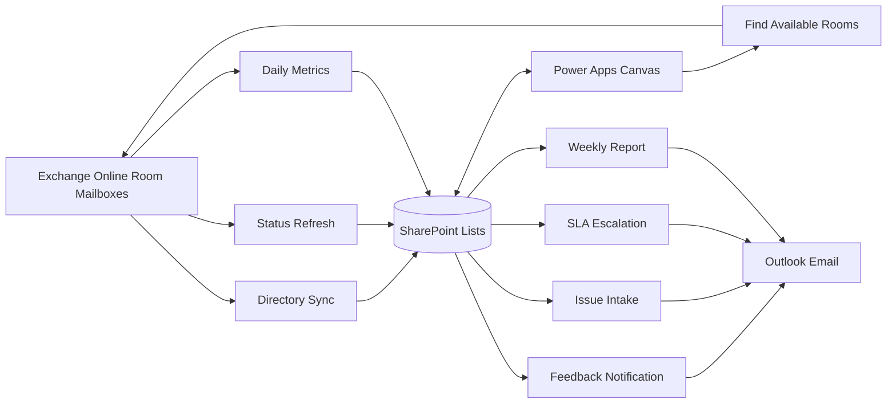

# Architecture

## Design goals

1. Exchange Online room mailboxes remain the authoritative booking source.
2. Power Automate converts calendar data into small operational/reporting caches.
3. SharePoint stores room metadata, current status, check-ins, feedback, issues, configuration, and aggregates.
4. Power Apps reads small/current collections and writes user interactions.
5. Office 365 Outlook sends operational notifications and weekly reports.
6. No PCF is required.

## Logical flow

## Three data grains

### Current grain
`CRM_RoomStatus`: one row per room.

Used for:
- live dashboard
- current/next booking
- status freshness
- out-of-service state

### Room-day grain
`CRM_RoomDailyMetrics`: one row per room per day.

Used by flows to:
- build rolling room metrics
- reconcile room history
- calculate weekly reports

The canvas app does **not** need to load thousands of room-day rows for its standard 7/30/90-day reports.

### Reporting-cache grain
- `CRM_RoomRollingMetrics`: one row per room
- `CRM_EstateDailyMetrics`: one row per date

These lists make the reporting screen scale cleanly even when `CRM_RoomDailyMetrics` grows well beyond the Power Apps client nondelegation limit.

## Status precedence

1. OutOfService
2. Busy
3. StartingSoon
4. Free
5. Unknown when stale or refresh failed

A connector/calendar failure must never be interpreted as Free.

## Privacy default

Do not persist:
- meeting body
- attendee list
- historical meeting subject
- historical organizer

Current subject/organizer fields exist only as optional live-snapshot fields and should remain disabled unless policy explicitly approves them.

## Calendar occupancy vs physical presence

The default solution measures scheduled/calendar occupancy. Check-in can produce an **inferred no-show** metric, but lack of check-in does not prove absence. True physical presence requires a separate approved telemetry/sensor integration.

## Recommended cadence

- Directory + CalendarId sync: daily
- Status refresh: every 5 minutes
- Daily room/estate/rolling metrics: nightly
- Feedback: event-driven
- Issue intake: event-driven
- SLA escalation: hourly
- Weekly report: weekly
- Find-a-room: on demand from Power Apps
